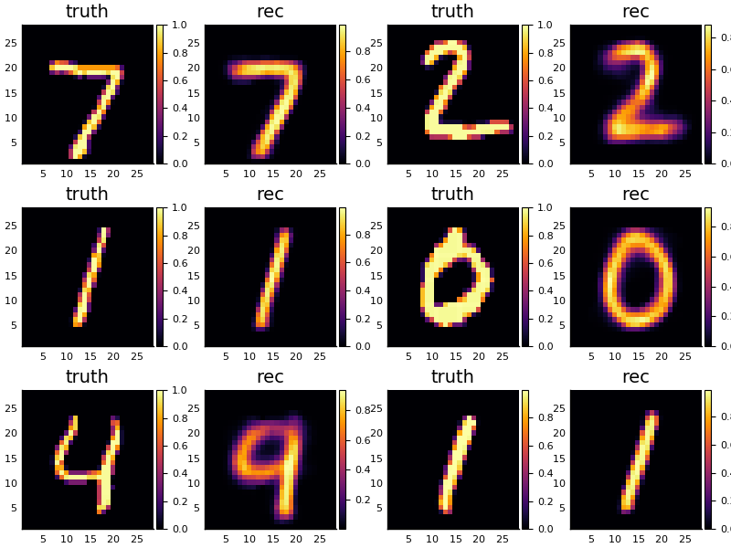
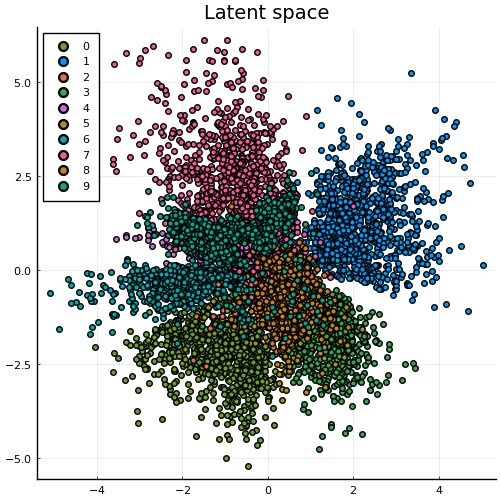

[](https://codecov.io/gh/aicenter/GenerativeModels.jl)

# GenerativeModels.jl

This library contains a collection of generative models.
It uses trainable
[`ConditionalDists.jl`](https://github.com/aicenter/ConditionalDists.jl) that
can be used in conjuction with [`Flux.jl`](https://github.com/FluxML/Flux.jl)
models.  Probability measures such as KL divergence are defined in
[`IPMeasures.jl`](https://github.com/aicenter/IPMeasures.jl) This package aims
to make experimenting with new models as easy as possible.

As an example, check out how to build a conventional variational autoencoder (VAE)
that reconstructs MNIST below.

# Reconstructing MNIST
First we load the MNIST training dataset
```julia
using MLDatasets, Flux
train_x, _ = MNIST.traindata(Float32)
flat_x = reshape(train_x, :, size(train_x,3)) |> gpu
data = Flux.Data.DataLoader(flat_x, batchsize=200, shuffle=true);
```


and define some parameters for a VAE with an input length `xlength` and latent
vector of `zlength`.
```julia
using ConditionalDists

xlength = size(flat_x, 1)
zlength = 2
hdim    = 512
hd2     = Int(hdim/2)
```


We define an `encoder` with diagonal variance on the latent dimension,
which is just a Flux model wrapped in a `ConditionalMvNormal`.  The Flux model
must return a tuple with the appropriate number of parameters - in case of a
`MvNormal` two: mean and variance.  Hence, the `SplitLayer` returns two vectors
of `zlength`, one of which (the variance) is constrained to be positive.
```julia
using ConditionalDists: SplitLayer

# mapping that will be trained to output mean and variance
enc_map = Chain(Dense(xlength, hdim, relu),
                Dense(hdim, hd2, relu),
                SplitLayer(hd2, [zlength,zlength], [identity,softplus]))
# conditional encoder (can be called e.g. like `rand(encoder,x)`, see ConditionalDists.jl)
encoder = ConditionalMvNormal(enc_map)
```


The decoder will return a Multivariate Normal with scalar variance:
```julia
dec_map = Chain(Dense(zlength, hd2, relu),
                Dense(hd2, hdim, relu),
                SplitLayer(hdim, [xlength,1], σ))
decoder = ConditionalMvNormal(dec_map)
```


Now we can create the VAE model and train it to maximize the ELBO.
```julia
using GenerativeModels

model = VAE(zlength, encoder, decoder) |> gpu
loss(x) = -elbo(model,x)

ps = Flux.params(model)
opt = ADAM()

for e in 1:50
    @info "Epoch $e" loss(flat_x)
    Flux.train!(loss, ps, data, opt)
end
```


Some test reconstructions and the corresponding latent space are shown below:
```julia
model = model |> cpu
test_x, test_y = MNIST.testdata(Float32)
p1 = plot_reconstructions(model, test_x[:,:,1:6])
```




